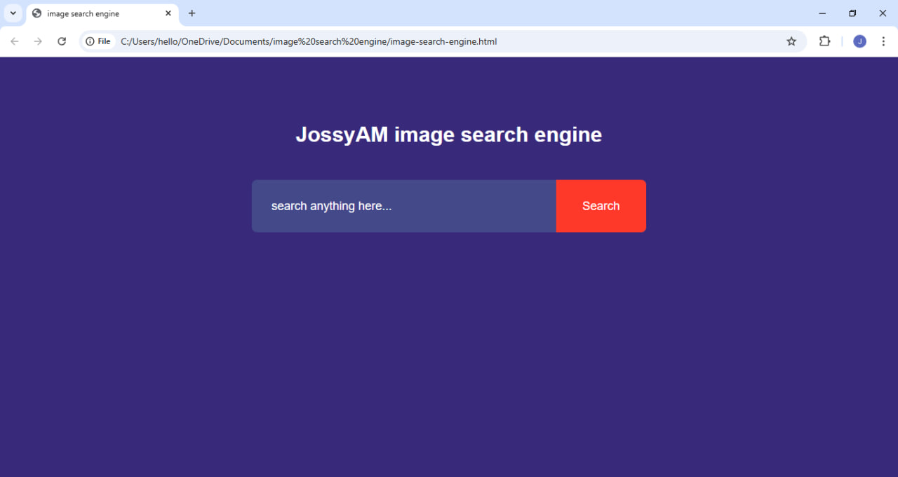
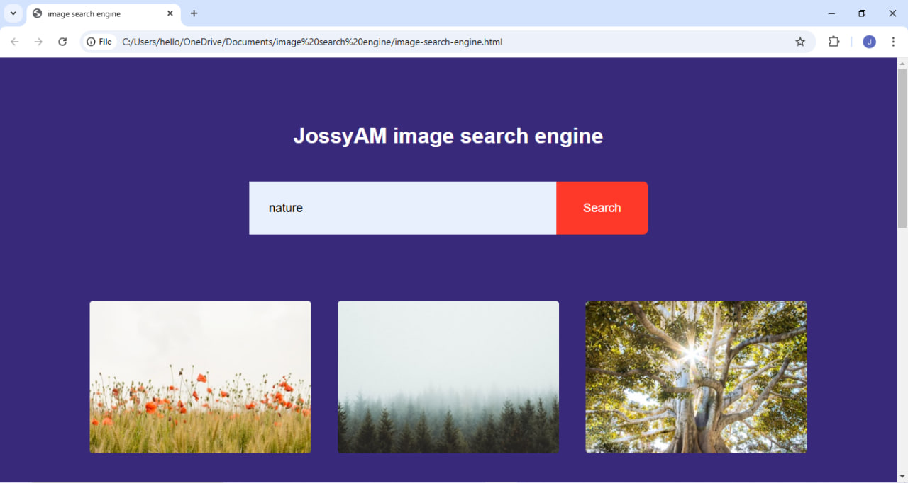
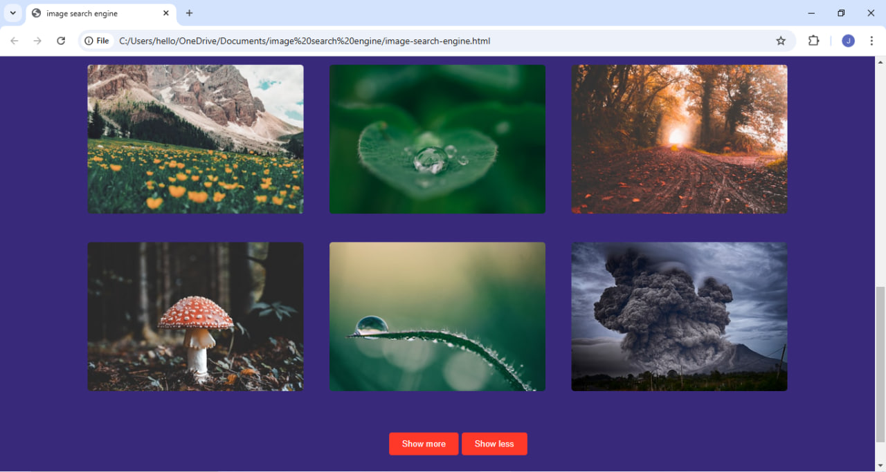
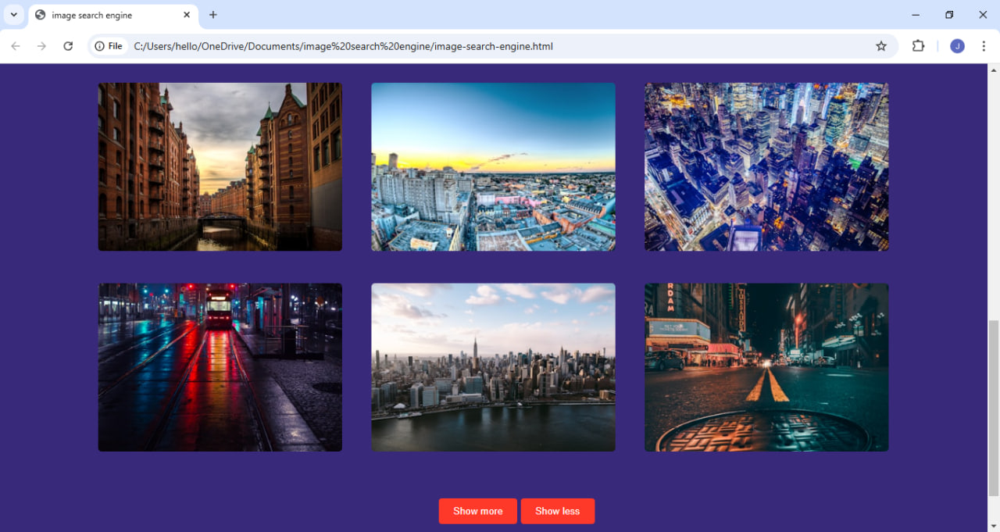
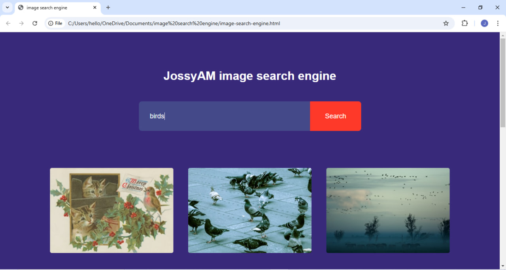
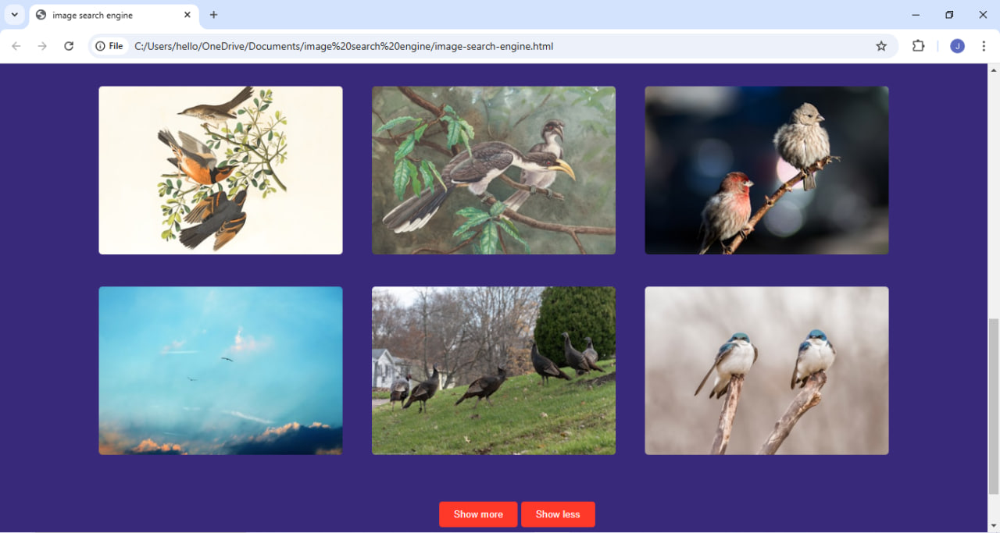

# Image_search_engin_using_JS
### GitHub Project Description for "Image Search Engine"

**Project Name:** JossyAM Image Search Engine

**Description:**  
The **Image Search Engine** is a simple yet powerful web application that allows users to search for images based on keywords. Leveraging the Unsplash API, it provides high-quality image results with options to explore more images by navigating through pages.

### Features:
- **Responsive Design**: A clean and modern UI that adapts to various devices.
- **Keyword-based Search**: Search for images by entering keywords.
- **Pagination Support**: Navigate through image results with "Show More" and "Show Less" buttons.
- **Direct Links**: Click on images to view them directly on Unsplash.

### Tech Stack:
- **HTML5**: For structuring the application layout.
- **CSS3**: For styling and responsive design.
- **JavaScript (ES6)**: For fetching and displaying images dynamically using the Unsplash API.

### How to Use:
1. Clone the repository:
   ```bash
   git clone https://github.com/your-username/image-search-engine.git
   ```
2. Obtain an API key from [Unsplash](https://unsplash.com/developers).
3. Replace the placeholder `accessKey` in the `script.js` file with your API key.
4. Open the `image-search-engine.html` file in a modern web browser.
5. Enter a keyword in the search bar, click "Search," and view the results.

### Screenshots:
#### Interface Form













### Contribution:
Contributions are welcome! Feel free to submit pull requests to improve functionality, enhance design, or fix bugs.
